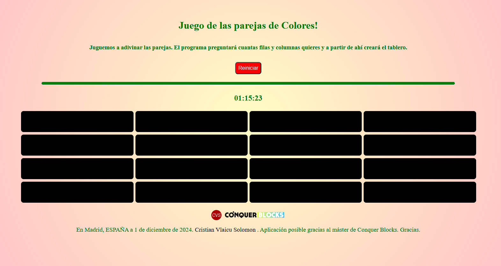
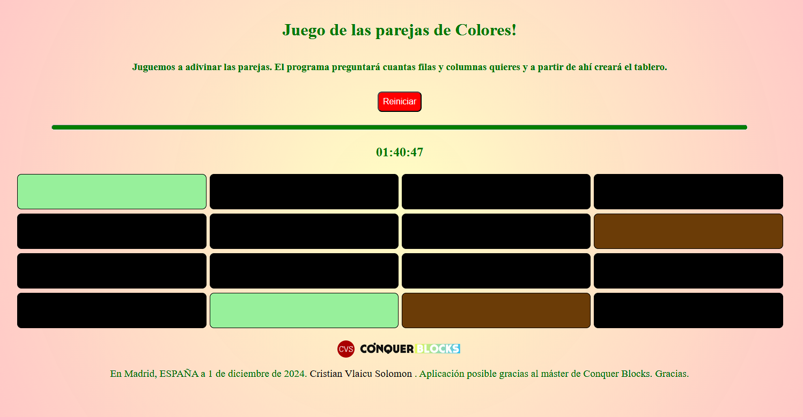
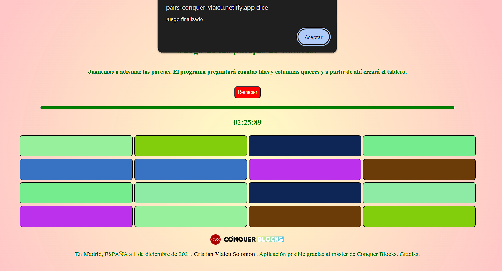

# What is this app?

&nbsp;&nbsp;👉 Esta aplicación web es un sencillo juego de emparejar las casillas con su conrrespondiente color. Van a pares con un color y hay que adivinar donde está la caja gemela de la que pinchemos por primera vez.

&nbsp;&nbsp;👉 El juego empieza pidiéndonos teclear el tamaño del tablero de juego (filas y columnas siempre pares para que se cree el tablero de manera correcta). Tiene un cronómetro que nos muestra el tiempo que estamos tardando en terminar el juego, es decir, en emparejar todas las casillas con el mismo color.

&nbsp;&nbsp;👉 Los datos del juego, los bloques emparejados y el cronómetro, se almacenan en la memoria local del navegador usado y al refrescar las ventana, se mantiene el estado precedente del juego. Sólo se reinician cuando clicamos en el botón Reiniciar.

&nbsp;&nbsp;👉 Podéis clonar el repositorio o descargar el archivo zip para así abrirlo con vuestro IDE favorito y lanzarlo con live server por ejemplo; o también podéis clicar directamente en la url de Netlify para que se abra directamente en vuestro navegador el juego: <a target="_blank" href="https://pairs-conquer-vlaicu.netlify.app/" ><b>https://pairs-conquer-vlaicu.netlify.app/</b></a>

&nbsp;&nbsp;👉 Todos los archivos de los códigos de JavaScript están comentados para que se pueda seguir paso a paso la lógica del juego. También agrego tres capturas de pantalla del juego:

